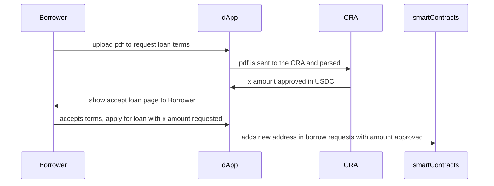

```mermaid
sequenceDiagram
Borrower ->> dApp: upload pdf to request loan terms
dApp ->> CRA: pdf is sent to the CRA and parsed
CRA ->> dApp: x amount approved in USDC
dApp ->> Borrower: show accept loan page to Borrower 
Borrower ->> dApp: accepts terms, apply for loan with x amount requested
dApp ->> smartContracts: adds new address in borrow requests with amount approved
```

